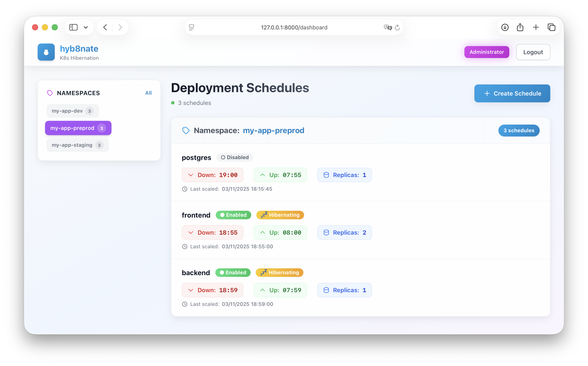

<div>
    <div style="float: left">
        
    </div>
    <div>
        <h1>
          hyb8nate
        </h1>
    </div>
</div>

<div align="center">



**Intelligent Kubernetes deployment hibernation scheduler**

[](https://github.com/hyb8nate/hyb8nate/actions/workflows/docker-publish.yml)
[](https://hub.docker.com/r/hyb8nate/hyb8nate)
[](LICENSE)
[](https://www.python.org/downloads/)
[](https://www.typescriptlang.org/)

All-in-one service to automatically hibernate (scale to 0) your Kubernetes deployments based on time schedules.

[Features](#-features) • [Quick Start](#-quick-start) • [Installation](#-installation) • [Documentation](#-usage)

</div>

---


## 🎯 Overview

**hyb8nate** (pronounced "hibernate") is a Kubernetes-native application that automatically scales down your deployments during off-hours and scales them back up when needed. Save resources, reduce costs, and optimize your cluster utilization without manual intervention.

Perfect for:

- 🌙 **Development/staging environments** during night hours
- 🏖️ **Non-production workloads** during weekends
- 💰 **Cost optimization** on cloud providers
- 🔋 **Energy-efficient** cluster management

## ✨ Features

### 🕐 Flexible Scheduling

- **Time-based scaling**: Define custom scale-down and scale-up times (HH:MM format)
- **Timezone support**: Configure schedules in your local timezone (e.g., `Europe/Paris`, `US/Central`)
- **Preset templates**: Quick setup with common patterns (night, lunch break, evening)
- **Minute-precise execution**: Schedules execute at exactly HH:MM:00

### 🔒 Security & Control

- **Namespace labeling**: Only namespaces with `hyb8nate.xyz/enabled=true` label can be scheduled
- **Per-deployment control**: Enable/disable schedules individually
- **Conflict detection**: Prevents duplicate schedules for the same deployment
- **State restoration**: Automatically restores original replica count
- **Smart enable/disable**: Scales deployments intelligently when toggling schedules

### 🎨 Modern UI

- **Real-time dashboard**: Monitor all schedules at a glance
- **Easy management**: Create, edit, and delete schedules with a clean interface
- **Status tracking**: See which deployments are currently hibernated
- **Responsive design**: Works on desktop, tablet, and mobile

### 🚀 Production Ready

- **All-in-one deployment**: Single Docker image with backend + frontend
- **In-cluster execution**: Runs directly in your Kubernetes cluster
- **SQLite backend**: Simple, reliable, no external database needed
- **Persistent storage**: Survives pod restarts with PersistentVolume
- **Health checks**: Built-in liveness and readiness probes
- **Minimal permissions**: RBAC with least privilege principle
- **Multi-architecture**: Supports AMD64 and ARM64

### 💤 Automatic snooze labels

- **FluxCD & ArgoCD**: sync snooze labels added automatically if needed

## 🏗️ Architecture

```
┌────────────────────────────────────────────────────────┐
│                    Kubernetes Cluster                  │
│                                                        │
│  ┌────────────────────────────────────────────────┐    │
│  │              hyb8nate Pod                      │    │
│  │                                                │    │
│  │  ┌──────────────┐        ┌─────────────────┐   │    │
│  │  │   FastAPI    │◄──────►│   React SPA     │   │    │
│  │  │   Backend    │        │   Frontend      │   │    │
│  │  └──────┬───────┘        └─────────────────┘   │    │
│  │         │                                      │    │
│  │         ├─────────► SQLite Database            │    │
│  │         │            (PersistentVolume)        │    │
│  │         │                                      │    │
│  │  ┌──────▼────────┐                             │    │
│  │  │  Scheduler    │                             │    │
│  │  │  (APScheduler)│                             │    │
│  │  └──────┬────────┘                             │    │
│  └─────────┼──────────────────────────────────────┘    │
│            │                                           │
│            ▼                                           │
│  ┌─────────────────────────────────────────────┐       │
│  │        Kubernetes API Server                │       │
│  │  (Scale Deployments via Apps/v1 API)        │       │
│  └─────────────────────────────────────────────┘       │
│                                                        │
└────────────────────────────────────────────────────────┘
```

**Technology Stack**:

- **Backend**: Python 3.13 + FastAPI + APScheduler
- **Frontend**: React + TypeScript + Tailwind CSS
- **Database**: SQLite (embedded, no external DB needed)
- **Kubernetes Client**: Official Python kubernetes client
- **Container**: All-in-one Docker image (backend serves static frontend)

## 🚀 Quick Start

### Prerequisites

- Kubernetes cluster (v1.21+)
- `kubectl` configured to access your cluster
- Cluster-admin permissions (for initial RBAC setup)

### 1. Label your namespaces

Only namespaces with the label `hyb8nate.xyz/enabled=true` can create schedules:

```bash
kubectl label namespace my-dev-namespace hyb8nate.xyz/enabled=true
kubectl label namespace my-staging-namespace hyb8nate.xyz/enabled=true
```

### 2. Deploy hyb8nate

```bash
kubectl apply -f https://raw.githubusercontent.com/hyb8nate/hyb8nate/main/k8s/all-in-one.yaml
```

### 3. Access the UI

```bash
# Port forward to access locally
kubectl port-forward -n hyb8nate svc/hyb8nate 8000:8000
```

Open your browser at: **http://localhost:8000**

Default login password: `admin` (⚠️ change it via `ADMIN_PASSWORD` environment variable)

### 4. Create your first schedule

1. Select a namespace and deployment
2. Set scale-down and scale-up times
3. Click "Create Schedule"
4. Done! Your deployment will automatically hibernate at the scheduled time

## 📦 Installation

### Option 1: All-in-One Manifest (Recommended)

Deploy everything with a single command:

```bash
kubectl apply -f https://raw.githubusercontent.com/hyb8nate/hyb8nate/main/k8s/all-in-one.yaml
```

This creates:
- `hyb8nate` namespace
- ServiceAccount with RBAC permissions
- PersistentVolumeClaim (1Gi for SQLite database)
- Deployment (all-in-one image)
- ClusterIP Service
- (Optional) Ingress

### Option 3: Helm Chart (Coming Soon)

```bash
helm repo add hyb8nate https://hyb8nate.github.io/charts
helm install hyb8nate hyb8nate/hyb8nate \
  --set admin.password=your-secure-password \
  --set timezone=Europe/Paris
```

## ⚙️ Configuration

### Environment Variables

| Variable | Description | Default | Required |
|----------|-------------|---------|----------|
| `ADMIN_PASSWORD` | Admin login password | `admin` | ❌ |
| `JWT_SECRET_KEY` | Secret key for JWT tokens | Auto-generated | ❌ |
| `ACCESS_TOKEN_EXPIRE_MINUTES` | JWT token expiration (minutes) | `30` | ❌ |
| `TIMEZONE` | Timezone for schedules | `Europe/Paris` | ❌ |
| `LOG_LEVEL` | Logging level (DEBUG, INFO, WARNING, ERROR) | `INFO` | ❌ |
| `FLUXCD_OPTION` | Snooze label to avoid FluxCD sync | `false` | ❌ |
| `ARGOCD_OPTION` | Snooze label to avoid ArgoCD sync | `false` | ❌ |

### Example Configuration

```yaml
apiVersion: v1
kind: Secret
metadata:
  name: hyb8nate-secret
  namespace: hyb8nate
type: Opaque
stringData:
  admin-password: "your-secure-password"
---
apiVersion: v1
kind: ConfigMap
metadata:
  name: hyb8nate-config
  namespace: hyb8nate
data:
  TIMEZONE: "America/New_York"
  LOG_LEVEL: "INFO"
  NAMESPACE_LABEL_KEY: "hyb8nate.xyz/enabled"
  NAMESPACE_LABEL_VALUE: "true"
```

### Kubernetes Resources

**Minimum requirements**:

- **CPU**: 100m (requests), 300m (limits)
- **Memory**: 128Mi (requests), 256Mi (limits)
- **Storage**: 100M PersistentVolume for SQLite database

**RBAC Permissions** (read-only except for deployments):

```yaml
rules:
  - apiGroups: [""]
    resources: ["namespaces"]
    verbs: ["get", "list"]
  - apiGroups: ["apps"]
    resources: ["deployments"]
    verbs: ["get", "list", "patch"]
```

## 📘 Usage

### 1. Enable Scheduling for a Namespace

Label the namespace to allow hyb8nate to manage its deployments:

```bash
kubectl label namespace my-app hyb8nate.xyz/enabled=true
```

You can also customize the label key/value via environment variables.

### 2. Create a Schedule

**Via the UI**:

1. Open hyb8nate in your browser
2. Click **"New Schedule"** button
3. Select namespace from dropdown (only labeled namespaces appear)
4. Select deployment from dropdown
5. Set scale-down time (e.g., `22:00` for 10 PM)
6. Set scale-up time (e.g., `08:00` for 8 AM)
7. Click **"Create Schedule"**

**Via API**:

```bash
# 1. Login to get token
curl -X POST http://localhost:8000/api/auth/login \
  -H "Content-Type: application/json" \
  -d '{"password": "admin"}'

# 2. Create schedule (use the token from step 1)
curl -X POST http://localhost:8000/api/schedules \
  -H "Authorization: Bearer YOUR_TOKEN" \
  -H "Content-Type: application/json" \
  -d '{
    "namespace": "my-app",
    "deployment_name": "my-deployment",
    "scale_down_time": "22:00",
    "scale_up_time": "08:00"
  }'
```

### 3. Monitor Schedules

**Dashboard View**:

- Green badge: Schedule is enabled
- Red badge: Schedule is disabled
- "Currently scaled down" indicator: Deployment is hibernated

**Via API**:

```bash
curl http://localhost:8000/api/schedules \
  -H "Authorization: Bearer YOUR_TOKEN"
```

### 4. Edit a Schedule

- **Via UI**: Click the edit icon (✏️) next to the schedule
- **Via API**: Send a PATCH request to `/api/schedules/{id}`

**Smart behavior**:

- If you **disable** a schedule that's currently hibernated, it scales back up immediately
- If you **enable** a schedule during hibernation period, it scales down immediately

### 5. Delete a Schedule

When you delete a schedule, hyb8nate automatically scales the deployment back to its original replica count if it's currently hibernated.

## 🔍 How It Works

1. **Schedule Creation**: When you create a schedule, hyb8nate saves the current replica count
2. **Periodic Check**: APScheduler checks every minute if any schedule should trigger
3. **Scale Down**: At scale-down time, deployment is scaled to 0 replicas
4. **Scale Up**: At scale-up time, deployment is restored to original replica count
5. **State Persistence**: All state is saved in SQLite database (survives restarts)
6. **Timezone Aware**: All times are interpreted in the configured timezone

### Example Timeline

**Schedule**: Scale down at 22:00, Scale up at 08:00 (timezone: Europe/Paris)

```
07:00 ────► ✅ Deployment running (3 replicas)
22:00 ────► 🌙 Scaled down to 0 replicas (hibernation starts)
23:30 ────► 💤 Still hibernated (0 replicas)
08:00 ────► ☀️ Scaled up to 3 replicas (back to normal)
10:00 ────► ✅ Running normally (3 replicas)
```

## 🔧 Development

### Local Development

**Prerequisites**:

- Python 3.13+
- Node.js 22+
- uv (Python package manager)
- Access to a Kubernetes cluster (for testing)

**Backend**:

```bash
cd backend
uv sync
uv run python main.py
# API available at http://localhost:8000
# Swagger docs at http://localhost:8000/api/docs
```

**Frontend**:

```bash
cd frontend
npm install
npm run dev
# UI available at http://localhost:5173
```

**Build Docker image**:

```bash
docker build -t hyb8nate:dev .
```

## 🛠️ Troubleshooting

### Schedule not triggering

**Check scheduler is running**:

```bash
kubectl logs -n hyb8nate -l app=hyb8nate -f | grep "Scheduler started"
```

**Check schedule exists and is enabled**:

```bash
curl http://localhost:8000/api/schedules \
  -H "Authorization: Bearer YOUR_TOKEN"
```

**Check timezone configuration**:

```bash
kubectl get deployment -n hyb8nate hyb8nate -o jsonpath='{.spec.template.spec.containers[0].env[?(@.name=="TIMEZONE")].value}'
```

### Permission denied errors

**Check RBAC permissions**:

```bash
kubectl auth can-i get deployments --as=system:serviceaccount:hyb8nate:hyb8nate -n my-namespace
kubectl auth can-i patch deployments --as=system:serviceaccount:hyb8nate:hyb8nate -n my-namespace
```

### Namespace not appearing in dropdown

**Check namespace has required label**:

```bash
kubectl get namespace my-namespace -o jsonpath='{.metadata.labels.hyb8nate\.xyz/enabled}'
# Should output: true
```

**Add label if missing**:

```bash
kubectl label namespace my-namespace hyb8nate.xyz/enabled=true
```

### Database corrupted

**Reset database** (⚠️ this deletes all schedules):

```bash
kubectl delete pvc -n hyb8nate hyb8nate-data
kubectl delete pod -n hyb8nate -l app=hyb8nate
```

## 🤝 Contributing

Contributions are welcome! Please feel free to submit a Pull Request.

1. Clone the repository
2. Create your feature branch (`git checkout -b dev-feature/amazing-feature`)
3. Commit your changes (`git commit -m 'feat: some amazing feature'`)
4. Push to the branch (`git push origin dev-feature/amazing-feature`)
5. Open a Pull Request

## 📝 License

This project is licensed under the MIT License - see the [LICENSE](LICENSE) file for details.

## 🙏 Acknowledgments

- Built with [FastAPI](https://fastapi.tiangolo.com/) and [React](https://react.dev/)
- Kubernetes client library by [Kubernetes](https://github.com/kubernetes-client/python)
- Scheduling powered by [APScheduler](https://apscheduler.readthedocs.io/)
- UI components inspired by [Tailwind UI](https://tailwindui.com/)

## 📞 Support

- 📖 [Documentation](https://github.com/hyb8nate/hyb8nate/wiki)
- 🐛 [Issue Tracker](https://github.com/hyb8nate/hyb8nate/issues)
- 💬 [Discussions](https://github.com/hyb8nate/hyb8nate/discussions)

---

<div align="center">

Made with ❤️ for the Kubernetes community

⭐ Star us on GitHub if you find this project useful!

</div>
